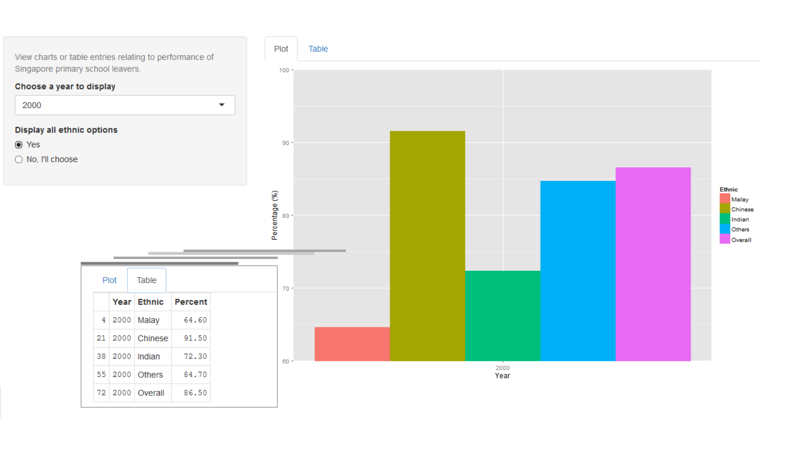

Performance of PSLE Students Scoring A*-C in Standard Mathematics
========================================================
author: Siew Choo
date: 19 Jul 2015
transition: rotate
width: 1920
height: 1080

Some Background Information
========================================================
<br/>
**Singapore Primary Education**
<ul>
    <li>Children attend primary school from 7 years old (Primary 1) to 12 years old (Primary 6).</li>
    <li>PSLE (Primary School Leaving Examination)
        <ul>
            <li>Annual national examination all Primary 6-ers sit for.</li>
            <li>Standard subjects tested: English, Mother Tongue, Science and Mathematics.</li>
            <li>Grading system: A* (highest grade), followed by A, B, C, D and E (lowest).</li>
        </ul>
    </li>
</ul>
<br/>
<br/>
**Project Information**
- [Application](https://siewchoo.shinyapps.io/Developing_Data_Products_Course_Project) enables users to visualize data with plots or tables by selecting the relevant 
  - ethnic group option (Malay, Chinese, Indian, Others, Overall)
  - year options (1997 to 2013 *or* All years).
- Plot may be a line chart (plotting all years) or histograms (plotting individual year), regardless of ethnic option.
- Dataset can be found at the [data.gov.sg portal](http://data.gov.sg/).


Storytelling With Data
===
left: 30%


```
   Year  Ethnic Percent
69 1997 Overall    85.4
70 1998 Overall    84.6
71 1999 Overall    85.7
72 2000 Overall    86.5
73 2001 Overall    82.8
74 2002 Overall    83.0
75 2003 Overall    83.3
76 2004 Overall    83.2
77 2005 Overall    83.9
78 2006 Overall    84.1
79 2007 Overall    83.2
80 2008 Overall    83.1
81 2009 Overall    83.8
82 2010 Overall    84.1
83 2011 Overall    84.2
84 2012 Overall    85.3
85 2013 Overall    85.3
```
- Not without merits: numbers give details, absolute values.

***


- Gives a quick, big picture, "easy to consume".
- Shape highlights relationships, trends and exceptions.
- Comparatively better delivery format for an application wrt to screen real estate.


Choice of Visualization options: Plot or Table
========================================================
transition: linear



When Things Get Complicated
========================================================
transition: linear


